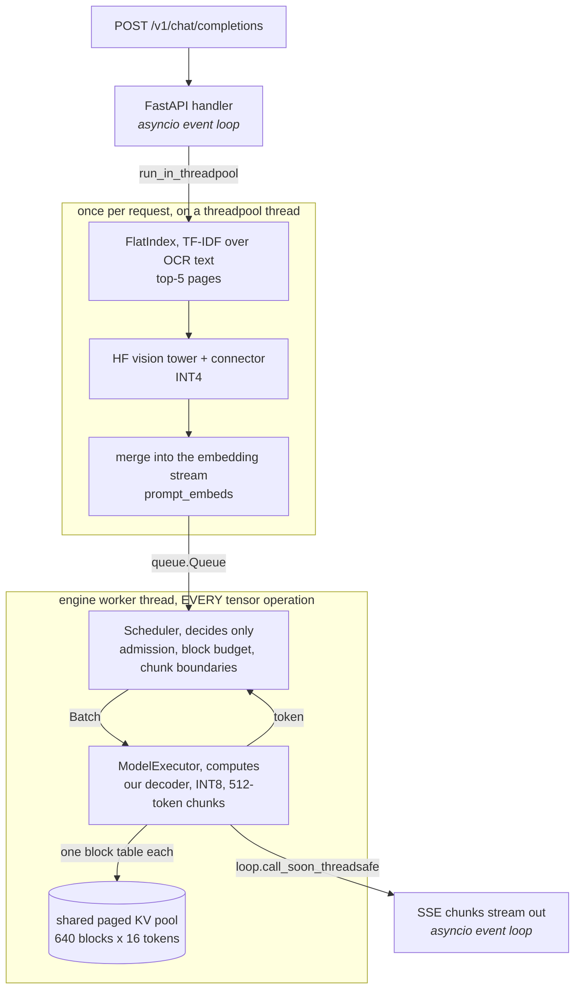

# EdgeRAG

**A complete multimodal RAG pipeline — image + text corpus → retrieval → VLM generation — running
entirely within a fixed 4 GB memory budget.**

No LangChain. No LlamaIndex. No `model.generate()`. The paged KV-cache allocator, the
continuous-batching scheduler, the visual-token compressor, and the quantized linear layers are
written here, not imported.

> **Status: Phase 7 of 8 (Aug 19, 2026).** The decoder, paged KV cache, scheduler, visual-token
> compressor, INT4 quantization, hybrid retrieval and the streaming server are built and measured
> — `/v1/chat/completions` answers a document question from retrieved pages on the 2.2B model, at
> 2.30 GiB of weights. Phase 8 is the final write-up. Every number below is measured or exactly
> computed, with its source file named; what is still unmeasured is listed under
> [Known limitations](#known-limitations) rather than left blank. See [`PLAN.md`](PLAN.md) for
> the phase schedule.

---

## Why the constraint is the project

Anyone can wire up RAG. The interesting question is what you have to build differently when the
whole pipeline — model weights, KV cache, vision encoder, embeddings, and index — has to fit in
4 GB. Every design decision in [`CONTEXT.md`](CONTEXT.md) is downstream of that number.

The development GPU for this project is a **GTX 1650 with exactly 4096 MiB of VRAM**. The budget
is not a config flag on a large card; it is the machine.

---

## Architecture

What actually runs when a question arrives. **The `queue.Queue` edge is the boundary that matters**:
everything below it runs on one dedicated thread, one forward pass at a time. Above it, the
*event loop* never touches a tensor — the vision tower does, but on a threadpool thread and
exactly once per request, never inside the decode loop. Getting that split wrong (`BUGS.md` P-17)
inflates every *other* request's time-to-first-token by however long one forward pass takes, and
it presents as a model problem rather than a threading one.



Three things the picture is making explicit:

- **The scheduler decides; the executor computes.** `edgerag/sched/` contains no tensors at all,
  which is why its state machine — admission, chunked prefill, preemption policy — is tested in
  milliseconds without a GPU, and why a scheduling bug can never be mistaken for a cache bug.
- **Retrieval and the vision tower run once per request, before the queue.** Inside the executor
  they would re-run on every prefill chunk — about 14 times for a 7,000-token prompt.
- **One pool, many block tables.** The arena is allocated once at startup; each request gets an
  index into it. A pool per request is `BUGS.md` B-05, and it cost a full T4 session.

Resident at the default configuration: **2.30 GiB of weights** (INT8 language + INT4 vision) plus
a **1.88 GiB block pool**, against a 4 GiB budget — the arithmetic is
[`results/memory_ledger.md`](results/memory_ledger.md).

**Built and measured, deliberately not in this path.** Saying so is the point: each is real code
with real numbers behind it, and none of it is load-bearing for the server as configured.

| Component | Status |
|---|---|
| FastV visual-token pruning | measured (D17/D20); the executor passes no compressor — quality cost is too high to default to |
| Copy-on-write prefix sharing | measured 8.3%, 14.8% under canonical document ordering (D15); the executor gives each request its own block table |
| Preemption (swap-to-host) | implemented behind the scheduler's interface (D16); the executor grows blocks directly, so pool exhaustion fails the request instead |
| Image-space retrieval | measured out to noise (D22), so the index scores text only |

---

## Benchmarks

### Baseline — HuggingFace `generate()`, SmolVLM2-2.2B, Tesla T4

Every later number is measured against this. Workload is the frozen trace `94b148a0b9f5006e`:
k=5 retrieved document pages per query, ~6,758 prefill tokens median, 75.4% of them visual.

| batch | TTFT p50 | tok/s per seq | tok/s aggregate | peak allocated |
|---:|---:|---:|---:|---:|
| 1 | 3,730 ms | 26.0 | 26.0 | **5.76 GiB** |
| 2 | 11,071 ms | 15.9 | 31.8 | 7.90 GiB |
| 4 | 25,006 ms | 8.6 | 34.6 | 12.41 GiB |

**The baseline does not fit the 4 GB target for even one request.** 5.76 GiB at batch 1, before
any concurrency. The problem is not that the naive pipeline is inefficient — it is that it does
not run on the target device.

Two things this table is saying that are easy to misread:

- **Aggregate throughput rises 1.32× for 4× the batch.** Per-sequence tok/s *falls*; that is
  batching working, not failing. The ceiling is low because this checkpoint is MHA (32 query
  heads, 32 KV heads), so decode is bandwidth-bound on KV reads at 192 KiB/token. Scheduling
  cannot recover that — only cutting KV bytes can.
- **TTFT degrades superlinearly** (1× → 2.97× → 6.7×), because left-padding pads every request to
  the batch maximum. This is what chunked prefill has to fix.

**KV cache on/off** at batch 1: 25.95 tok/s vs **0.26 tok/s — 100×**, against the 2–3× a
short-prompt workload would show. Without a cache each decode step re-attends the whole
6,758-token prefix, so one decode step costs one full prefill. Notably it saves only 0.24 GiB,
so at batch 1 the cache is nearly free in memory terms; paging earns its keep at concurrency.

Methodology is fixed and enforced in code, not by convention:

- warmup discarded, `torch.cuda.synchronize()` on both sides of every timed region
- p50/p95/p99 reported, never a bare mean; p99 flagged when computed from <100 samples
- ≥5 trials with standard deviation
- TTFT and decode throughput aggregated separately — prefill is compute-bound, decode is
  memory-bound, and conflating them hides the thing that matters
- peak-memory counter reset between runs
- every record stamps its device, driver, torch build, and held-constant manifest; the harness
  **refuses to tabulate runs that did not hold the same variables fixed**

**Reference hardware is a Tesla T4.** The harness will not write a performance record on any other
device without an explicit override that stamps the result `trusted: false`. The local GTX 1650
has no tensor cores, so its timings are architecturally incomparable — it is used for correctness
and memory accounting only.

### The memory budget, line by line


**No single lever gets there at full quality.** Quantization takes the pipeline from 6.12 GiB
to 4.24; the configuration that keeps fp16 answer quality is still 0.24 GiB over. Only the
INT4 language model fits alone — and that costs 44% of ANLS. Closing the last 0.24 GiB is what
visual-token pruning is for, and the two levers are independent: KV is fp16 in every arm, so
the MiB pruning reclaims do not change with weight precision.

`results/memory_ledger.md`, computed exactly from the checkpoint config — no weights loaded, no
GPU involved, because quantized bytes are a function of tensor shape and nothing else. Weights
only, GiB:

| arm | bits | language | vision | connector | total | vs fp16 |
|---|---:|---:|---:|---:|---:|---:|
| fp16 | 16 | 3.376 | 0.769 | 0.040 | **4.185** | 1.00× |
| LM | 8 | 1.900 | 0.769 | 0.040 | 2.708 | 1.55× |
| LM+ViT | 8 | 1.900 | 0.515 | 0.020 | 2.435 | 1.72× |
| ViT | 8 | 3.376 | 0.515 | 0.020 | 3.911 | 1.07× |
| LM | 4 | 1.150 | 0.769 | 0.040 | 1.958 | 2.14× |
| **LM+ViT** | **4** | **1.150** | **0.386** | **0.010** | **1.546** | **2.71×** |
| ViT | 4 | 3.376 | 0.386 | 0.010 | 3.772 | 1.11× |


**INT4 buys 2.71×, not 4×, and the shortfall is three named line items** rather than a rounding
error: the `lm_head` at 192 MiB (deliberately fp16 — its error reaches `argmax` with nothing
downstream to attenuate it), embeddings and norms at 193 MiB (not linear layers at all), and 255
MiB of the vision MLP whose `in_features = 4304 = 16 × 269` no power-of-two group size above 16
divides. Quoting 4× means counting only the layers you quantized and calling that the model.

The fp16 arm supports **zero** concurrent requests: its weights alone exceed the budget before a
single KV block is allocated. That is the honest framing of this project — not "4× less memory"
but *runs at all versus does not*.

All three terms in the plot above are now grounded: weights and KV are computed exactly from the
checkpoint config and confirmed to the byte against a loaded T4 model, and the activation term is
**measured** (0.690 GiB, mean of the two arms run after the prefill-logits fix) rather than
inferred as it was when the ledger was first written.

The budget is defined as `torch.cuda.max_memory_allocated()` and **excludes the CUDA context**
(300–600 MiB on Turing), which is reported separately because it is a driver cost, not a pipeline
cost — and at 8–15% of the ceiling it is not a rounding error.

### What paging actually buys, and what it does not

Exact allocator arithmetic over all 650 trace requests (`results/paged_memory.json`):

- **Internal fragmentation is 0.0–0.5% for every block size from 1 to 64.** Block size does not
  matter on this workload; 16 is chosen because fragmentation is free and it minimises block-table
  length.
- **Prefix sharing saves 8.3%** — and **14.8% if retrieved documents are ordered canonically
  rather than by relevance**, a 78% improvement for a one-line change in prompt assembly. Ordering
  the retrieved set is a prefix-cache-hit-rate decision, not only a relevance decision.
- **The 4–8× concurrency multiple is not reachable here, and the README will not claim it.**
  Measured: 1 sequence → 2. RAG requests already sit at 81% of maximum context, so right-sizing
  the reservation can only ever recover 1.24×. What paging genuinely buys on this workload is no
  per-token reallocation and block-granularity admission and eviction — the latter is what makes
  the scheduler possible at all.

**The gather is the cost.** Paged attention itself is free (+0.55% against attention over an
already-contiguous cache), but materialising the gathered KV costs **72.7% of the paged attention
path** at the median request length — 23.5 ms per decode step against 8.8 ms of attention. A
head-major pool layout took ~20% off that and did not change the conclusion: the fused kernel is
required, not optional, and it is not written.

### Visual token pruning: the price, not just the saving


FastV at layer 2, 40 held-out requests (`results/pruning_quality.jsonl`):

| keep | ANLS (attention) | ANLS (uniform) | MiB reclaimed | TTFT |
|---:|---:|---:|---:|---:|
| 1.000 | 0.438 | — | 0 | 2.63 s |
| 0.750 | 0.381 | 0.265 | 224 | 2.00 s |
| 0.500 | 0.203 | 0.207 | 448 | 1.40 s |
| 0.375 | 0.149 | 0.234 | 560 | 1.14 s |
| 0.250 | 0.088 | 0.146 | 671 | 0.92 s |
| 0.125 | 0.053 | 0.076 | 783 | 0.71 s |

**The target was 50–75% of visual tokens removed with quality holding, and it is not reachable on
this workload.** Halving the visual tokens reclaims 448 MiB per request and costs 54% of ANLS;
there is no knee in the curve. The mechanism is the workload: on a document page the answer is
often a single number in one cell of one table, and a budget that drops half the page has an even
chance of dropping the cell. FastV was validated on natural images, where adjacent patches really
are redundant.

Attention-based scoring beats a uniform stride at keep=0.75 and **loses** below half — once the
budget is small, coverage beats salience. Read that table knowing n=40 gives a standard error near
0.06, so gaps under ~0.12 are ties; only the fall from keep=1.0 to keep=0.5 clearly clears it.

---

## Reproduce

```bash
python -m venv .venv && .venv/Scripts/activate
pip install -e ".[dev,serve]" --index-url https://download.pytorch.org/whl/cu124
pytest -q
python -m scripts.measure_memory_ledger
```

The memory ledger needs no GPU and no downloaded weights — it instantiates the checkpoint on the
`meta` device and prices it from shapes, in about two seconds. Everything that needs a T4 lives in
`scripts/colab_*.py` and refuses to record a number on any other device;
[`notebooks/COLAB.md`](notebooks/COLAB.md) is the runbook.

---

## Design decisions

Every non-obvious choice, with the alternative it beat and the condition that would reverse it,
is logged in [`CONTEXT.md`](CONTEXT.md).

## Known limitations

Populated as they are discovered rather than at the end. [`BUGS.md`](BUGS.md) carries the bug log
and the predicted failure modes this design is built to avoid.

- **INT4 is 4× slower than fp16, as predicted, and the fix is unbuilt.** Measured: 3.3–3.8 tok/s
  against fp16's 13.9. `QuantLinear` dequantizes then calls a normal matmul, and a T4 has no INT4
  tensor cores, so the packed bytes are expanded before they reach the multiplier. The memory win
  is real; the speed win needs the dequantize fused into the GEMV, which is not written.
- **Two of eight latency arms are still cross-session.** A single-session re-run resolved the
  headline question — the `ViT@int4` control lands at **0.976× fp16**, confirming vision precision
  does not touch decode, and grouping by *language* precision explains everything: fp16 1.00×,
  INT8 0.42×, INT4 0.27×, with arms differing only in vision agreeing to 2.4%. `ViT@int8` and
  `LM8+ViT4` were not reached before the runtime was reclaimed, so their ratios still divide across
  sessions. Measured variance: **~2% within a session, ~7.5% across** (fp16 at 13.24, 13.94, 14.31),
  which is why a cross-session comparison cannot resolve anything under ~10%.
- **The `peak` column mixes two code versions.** Six arms were measured before the prefill-logits
  fix and two after, a 272 MiB difference in the transient term. Weights and quality are
  unaffected. Records now stamp `code_version` so this cannot recur silently.
- **The fused paged-attention kernel is not written.** The gather is 72.7% of the paged attention
  path, well past the 25% threshold at which the design log said to revisit the decision. Triton
  has no Windows support, so this is Colab-only work that has not been scheduled.
- **The pruning quality curve is n=40.** Standard error ~0.06; most gaps in that table are ties.
  More queries, not more ratios, is where the next hour of T4 time should go.
- **Retrieval scores text only, because the image half measured out to noise.** Projecting the
  query through `embed_tokens` into the vision tower's output space gives a similarity spread 0.14×
  the text side's, with a mean per-query maximum indistinguishable from zero — so `alpha` defaults
  to pure text. Measured on the 256M fixture; the headline model's larger tower is unchecked, and
  reversing the default is a one-flag change if it behaves differently.
- **Retrieval recall is 20% at k=5 against a 37.6% ceiling.** Only 37.6% of held-out questions have
  a gold page carrying OCR text at all, so the text signal cannot reach the rest. That is roughly
  53% of what is reachable, not 20% of what is possible.
- **Preemption is not wired into the serving executor.** A request that exhausts the pool
  mid-generation fails rather than preempting a younger one; admission budgets the full request up
  front, so this only bites under copy-on-write pressure.
- **The CUDA context is excluded from the 4 GB budget** and has not been measured on the T4. At
  300–600 MiB it is 8–15% of the ceiling, so it is reported as a separate line rather than folded
  in or quietly ignored.

## Repo map

| Path | What |
|---|---|
| [`PLAN.md`](PLAN.md) | Phase schedule, gates, cut order |
| [`CONTEXT.md`](CONTEXT.md) | Decision log — every choice with its rejected alternative |
| [`BUGS.md`](BUGS.md) | Bug log + predicted failure modes |
| [`notebooks/COLAB.md`](notebooks/COLAB.md) | T4 runbook — every GPU measurement, in order |
| `bench/` | Benchmark harness (written before any feature work) + the shared request pipeline |
| `scripts/` | Measurement runners. `measure_*` are exact and local; `colab_*` require a T4 |
| `edgerag/core/` | Model, layers, quantized linear, memory budget |
| `edgerag/cache/` | Naive and paged KV cache, block allocator, copy-on-write |
| `edgerag/sched/` | Continuous-batching scheduler, admission control |
| `edgerag/compress/` | Visual token pruning / merging |
| `edgerag/retrieval/` | Embedding, index, RAG pipeline |
| `edgerag/serve/` | FastAPI serving layer |
