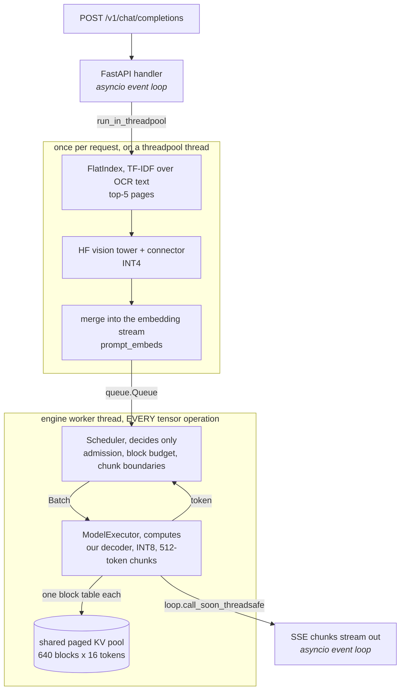
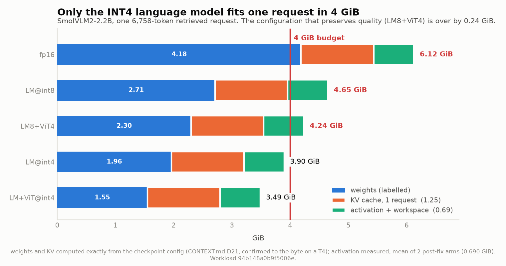
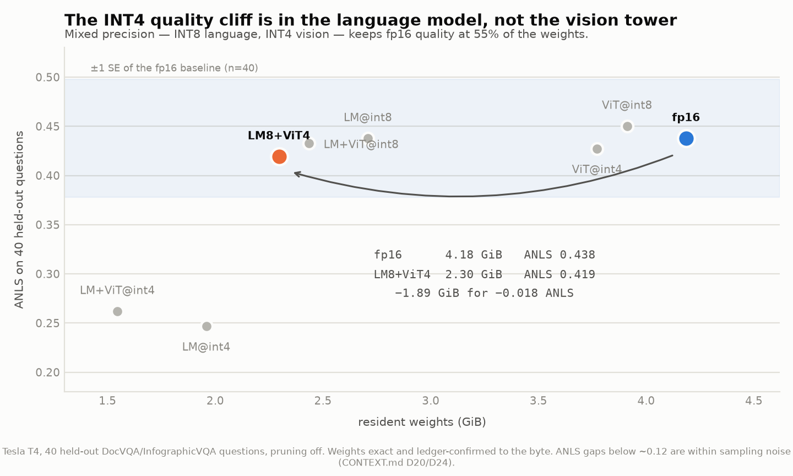
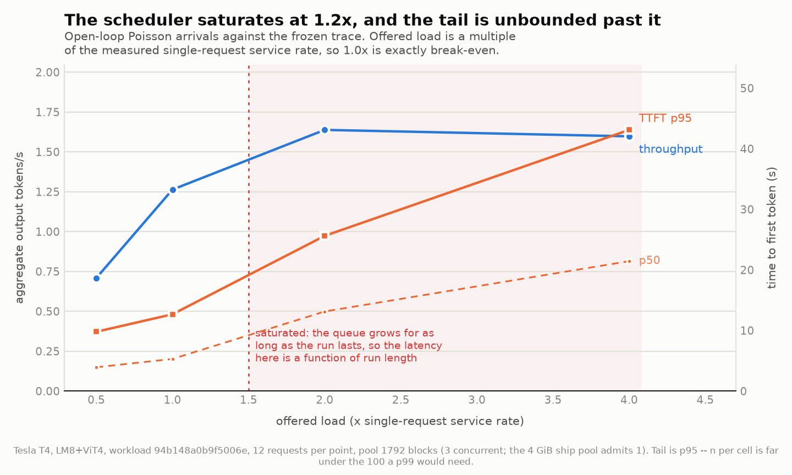
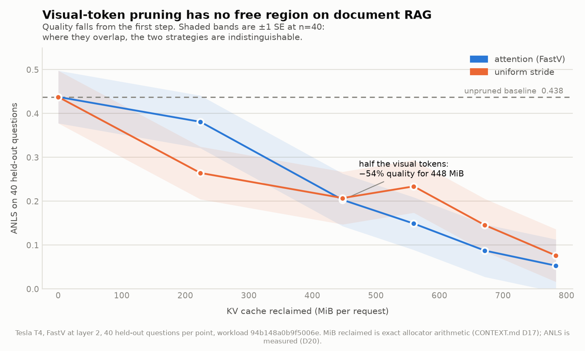

# EdgeRAG

**A complete multimodal RAG pipeline — image + text corpus → retrieval → VLM generation — serving
a 2.2B VLM in 4.000 GiB, weights and KV cache and activations included.**

The budget is not a target the project aims at; it is the number the block pool is *computed from*
at startup. What that buys is [a 7,472-token prompt](#does-it-actually-fit-in-4-gib), which covers
73% of the benchmark workload — the other 27% is refused at admission and the README says so.



<sup>A real recorded round trip, not a mockup — `results/demo_cast.json` is the transcript the
animation is rendered from, and `python -m scripts.make_demo` rebuilds it. Recorded on the 256M
fixture on a GTX 1650 because that is what fits on the dev box; **it shows that the path works,
not how fast it is.** Every performance number below is Tesla T4 only, and the harness
[refuses to record one anywhere else](#benchmarks).</sup>

No LangChain. No LlamaIndex. No `model.generate()`. The paged KV-cache allocator, the
continuous-batching scheduler, the visual-token compressor, and the quantized linear layers are
written here, not imported.

> **Status: Phase 8 of 8 (Aug 19, 2026).** The decoder, paged KV cache, scheduler, visual-token
> compressor, INT4 quantization, hybrid retrieval and the streaming server are built and measured
> — `/v1/chat/completions` answers a document question from retrieved pages on the 2.2B model, at
> 2.30 GiB of weights, and the scheduler has now been put
> [under Poisson load](#the-serving-layer-under-load) — sustained capacity
> **11.5–12.1 req/min**. Every number below is measured or exactly
> computed, with its source file named; what is still unmeasured is listed under
> [Known limitations](#known-limitations) rather than left blank. See [`PLAN.md`](PLAN.md) for
> the phase schedule.

---

## Why the constraint is the project

Anyone can wire up RAG. The interesting question is what you have to build differently when the
whole pipeline — model weights, KV cache, vision encoder, embeddings, and index — has to fit in
4 GB. Every design decision in [`CONTEXT.md`](CONTEXT.md) is downstream of that number.

The development GPU for this project is a **GTX 1650 with exactly 4096 MiB of VRAM**. The budget
is not a config flag on a large card; it is the machine.

---

## Architecture

What actually runs when a question arrives. **The `queue.Queue` edge is the boundary that matters**:
everything below it runs on one dedicated thread, one forward pass at a time. Above it, the
*event loop* never touches a tensor — the vision tower does, but on a threadpool thread and
exactly once per request, never inside the decode loop. Getting that split wrong (`BUGS.md` P-17)
inflates every *other* request's time-to-first-token by however long one forward pass takes, and
it presents as a model problem rather than a threading one.



Three things the picture is making explicit:

- **The scheduler decides; the executor computes.** `edgerag/sched/` contains no tensors at all,
  which is why its state machine — admission, chunked prefill, preemption policy — is tested in
  milliseconds without a GPU, and why a scheduling bug can never be mistaken for a cache bug.
- **Retrieval and the vision tower run once per request, before the queue.** Inside the executor
  they would re-run on every prefill chunk — about 14 times for a 7,000-token prompt.
- **One pool, many block tables.** The arena is allocated once at startup; each request gets an
  index into it. A pool per request is `BUGS.md` B-05, and it cost a full T4 session.

Resident at the default configuration, and this time the addition is done rather than left to the
reader: **2.296 GiB of weights** (INT8 language + INT4 vision) plus a **measured 0.324 GiB** of
activation leaves **1.380 GiB for the block pool — 471 blocks — for 4.000 GiB exactly.** The pool
is *derived from* the budget by `serve_rag.py --budget-gib 4.0`, not chosen and then compared
against it. Full arithmetic in [`results/memory_ledger.md`](results/memory_ledger.md);
what it costs is [below](#does-it-actually-fit-in-4-gib).

**Built and measured, deliberately not in this path.** Saying so is the point: each is real code
with real numbers behind it, and none of it is load-bearing for the server as configured.

| Component | Status |
|---|---|
| FastV visual-token pruning | measured (D17/D20); the executor passes no compressor — quality cost is too high to default to |
| Copy-on-write prefix sharing | measured 8.3%, 14.8% under canonical document ordering (D15); the executor gives each request its own block table |
| Preemption (swap-to-host) | implemented behind the scheduler's interface (D16); the executor grows blocks directly, so pool exhaustion fails the request instead |
| Image-space retrieval | measured out to noise (D22), so the index scores text only |

---

## Benchmarks

### Baseline — HuggingFace `generate()`, SmolVLM2-2.2B, Tesla T4

Every later number is measured against this. Workload is the frozen trace `94b148a0b9f5006e`:
k=5 retrieved document pages per query, ~6,758 prefill tokens median, 75.4% of them visual.

| batch | TTFT p50 | tok/s per seq | tok/s aggregate | peak allocated |
|---:|---:|---:|---:|---:|
| 1 | 3,730 ms | 26.0 | 26.0 | **5.76 GiB** |
| 2 | 11,071 ms | 15.9 | 31.8 | 7.90 GiB |
| 4 | 25,006 ms | 8.6 | 34.6 | 12.41 GiB |

**The baseline does not fit the 4 GB target for even one request.** 5.76 GiB at batch 1, before
any concurrency. The problem is not that the naive pipeline is inefficient — it is that it does
not run on the target device.

Two things this table is saying that are easy to misread:

- **Aggregate throughput rises 1.32× for 4× the batch.** Per-sequence tok/s *falls*; that is
  batching working, not failing. The ceiling is low because this checkpoint is MHA (32 query
  heads, 32 KV heads), so decode is bandwidth-bound on KV reads at 192 KiB/token. Scheduling
  cannot recover that — only cutting KV bytes can.
- **TTFT degrades superlinearly** (1× → 2.97× → 6.7×), because left-padding pads every request to
  the batch maximum. Chunked prefill was built to fix this, and
  [the measurement says it fixes something else](#the-serving-layer-under-load) — the decode
  phase, 4.2×, while making TTFT *worse*.

**KV cache on/off** at batch 1: 25.95 tok/s vs **0.26 tok/s — 100×**, against the 2–3× a
short-prompt workload would show. Without a cache each decode step re-attends the whole
6,758-token prefix, so one decode step costs one full prefill. Notably it saves only 0.24 GiB,
so at batch 1 the cache is nearly free in memory terms; paging earns its keep at concurrency.

Methodology is fixed and enforced in code, not by convention:

- warmup discarded, `torch.cuda.synchronize()` on both sides of every timed region
- p50/p95/p99 reported, never a bare mean; p99 flagged when computed from <100 samples
- ≥5 trials with standard deviation
- TTFT and decode throughput aggregated separately — prefill is compute-bound, decode is
  memory-bound, and conflating them hides the thing that matters
- peak-memory counter reset between runs
- every record stamps its device, driver, torch build, and held-constant manifest; the harness
  **refuses to tabulate runs that did not hold the same variables fixed**

**Reference hardware is a Tesla T4.** The harness will not write a performance record on any other
device without an explicit override that stamps the result `trusted: false`. The local GTX 1650
has no tensor cores, so its timings are architecturally incomparable — it is used for correctness
and memory accounting only.

### Does it actually fit in 4 GiB?

Yes, and the honest version of that answer has a cost attached. This is the configuration
`scripts/serve_rag.py` starts, priced against the budget it is named after
(`results/memory_ledger.md`, regenerated by the script that computes it):

| component | GiB | how it is known |
|---|---:|---|
| weights, `LM8+ViT4` | 2.296 | exact from tensor shapes, **confirmed on a T4 to 0 bytes** (D24) |
| activation + workspace | 0.324 | **measured** on the serving path at chunk 512 (D26) |
| KV block pool, 471 × 16 tokens | 1.380 | **derived**: whatever the budget has left |
| **total** | **4.000** | against a 4.00 GiB budget |

**A memory budget buys a prompt length, not an unlimited prompt.** This one buys **7,472 tokens**,
which covers **29 of the 40** frozen-trace requests. The longest 27% are **refused at admission**
rather than discovered as an OOM halfway through a decode. That refusal rate is the price of the
headline and it belongs next to it.

Two things this replaced, both worth stating because they are the kind of error that survives
review:

- **The shipped default was 640 blocks — 1.875 GiB — which puts the same pipeline at 4.495 GiB,
  507 MiB over.** Nothing was wrong with 640 on its own terms; it was never subtracted from
  anything. The README printed "2.30 GiB of weights" and "a 1.88 GiB block pool" a paragraph
  apart, under a 4 GiB headline, and left the addition to the reader.
- **The ledger priced an arm the server does not run.** Its in-budget row was `LM+ViT@int4` with a
  right-sized KV term; the server runs `LM8+ViT4` with a fixed pool. Different weights *and* a
  different KV number, so the table and the process it claimed to describe had drifted apart.

**Chunked prefill is what makes the budget reachable at all**, which was not why it was built.
It bounds the largest tensor a forward pass materialises, cutting the activation high-water mark
from **0.796 GiB to 0.324 GiB — 484 MiB**. Without it, weights plus activation alone are 3.09 GiB
and the remaining 0.91 GiB does not hold one median request's KV. So the feature that
[costs 1.51× on p95 TTFT](#the-serving-layer-under-load) is the same feature the 4 GiB claim rests
on; that trade is the project in miniature.

### The memory budget, line by line



**No single lever gets there at full quality.** Quantization takes the pipeline from 6.12 GiB
to 4.24; the configuration that keeps fp16 answer quality is still 0.24 GiB over. Only the
INT4 language model fits alone — and that costs 44% of ANLS. Closing the last 0.24 GiB is what
visual-token pruning is for, and the two levers are independent: KV is fp16 in every arm, so
the MiB pruning reclaims do not change with weight precision.

`results/memory_ledger.md`, computed exactly from the checkpoint config — no weights loaded, no
GPU involved, because quantized bytes are a function of tensor shape and nothing else. Weights
only, GiB:

| arm | bits | language | vision | connector | total | vs fp16 |
|---|---:|---:|---:|---:|---:|---:|
| fp16 | 16 | 3.376 | 0.769 | 0.040 | **4.185** | 1.00× |
| LM | 8 | 1.900 | 0.769 | 0.040 | 2.708 | 1.55× |
| LM+ViT | 8 | 1.900 | 0.515 | 0.020 | 2.435 | 1.72× |
| ViT | 8 | 3.376 | 0.515 | 0.020 | 3.911 | 1.07× |
| LM | 4 | 1.150 | 0.769 | 0.040 | 1.958 | 2.14× |
| **LM+ViT** | **4** | **1.150** | **0.386** | **0.010** | **1.546** | **2.71×** |
| ViT | 4 | 3.376 | 0.386 | 0.010 | 3.772 | 1.11× |



**INT4 buys 2.71×, not 4×, and the shortfall is three named line items** rather than a rounding
error: the `lm_head` at 192 MiB (deliberately fp16 — its error reaches `argmax` with nothing
downstream to attenuate it), embeddings and norms at 193 MiB (not linear layers at all), and 255
MiB of the vision MLP whose `in_features = 4304 = 16 × 269` no power-of-two group size above 16
divides. Quoting 4× means counting only the layers you quantized and calling that the model.

The fp16 arm supports **zero** concurrent requests: its weights alone exceed the budget before a
single KV block is allocated. That is the honest framing of this project — not "4× less memory"
but *runs at all versus does not*.

All three terms in the plot above are now grounded: weights and KV are computed exactly from the
checkpoint config and confirmed to the byte against a loaded T4 model, and the activation term is
**measured** (0.690 GiB, mean of the two arms run after the prefill-logits fix) rather than
inferred as it was when the ledger was first written.

The budget is defined as `torch.cuda.max_memory_allocated()` and **excludes the CUDA context**
(300–600 MiB on Turing), which is reported separately because it is a driver cost, not a pipeline
cost — and at 8–15% of the ceiling it is not a rounding error.

### What paging actually buys, and what it does not

Exact allocator arithmetic over all 650 trace requests (`results/paged_memory.json`):

- **Internal fragmentation is 0.0–0.5% for every block size from 1 to 64.** Block size does not
  matter on this workload; 16 is chosen because fragmentation is free and it minimises block-table
  length.
- **Prefix sharing saves 8.3%** — and **14.8% if retrieved documents are ordered canonically
  rather than by relevance**, a 78% improvement for a one-line change in prompt assembly. Ordering
  the retrieved set is a prefix-cache-hit-rate decision, not only a relevance decision.
- **The 4–8× concurrency multiple is not reachable here, and the README will not claim it.**
  Measured: 1 sequence → 2. RAG requests already sit at 81% of maximum context, so right-sizing
  the reservation can only ever recover 1.24×. What paging genuinely buys on this workload is no
  per-token reallocation and block-granularity admission and eviction — the latter is what makes
  the scheduler possible at all.

**The gather is the cost.** Paged attention itself is free (+0.55% against attention over an
already-contiguous cache), but materialising the gathered KV costs **72.7% of the paged attention
path** at the median request length — 23.5 ms per decode step against 8.8 ms of attention. A
head-major pool layout took ~20% off that and did not change the conclusion: the fused kernel is
required, not optional, and it is not written.

### The serving layer under load



Open-loop Poisson arrivals against the frozen trace, 12 requests per point, `LM8+ViT4`, one T4
session (`results/poisson_sweep.jsonl`, `CONTEXT.md` D25). Offered load is a multiple of the
**measured** single-request service rate — 6.19 s end to end, 3.78 s of it TTFT — so 1.0× is
exactly break-even rather than an arbitrary requests/second figure.

| offered load | req/min | ρ | tok/s end-to-end | mean in-flight | TTFT p50 | TTFT p95 | e2e p50 |
|---:|---:|---:|---:|---:|---:|---:|---:|
| 0.5× | 5.0 | 0.97 | 0.7 | 0.38 | **3.92 s** | **9.78 s** | 6.00 s |
| 1.0× | 8.9 | 1.09 | 1.3 | 0.81 | **5.30 s** | **12.67 s** | 9.69 s |
| 2.0× | **11.6** | 1.67 | 1.6 | 1.34 | 13.13 s † | 25.62 s † | 15.88 s |
| 4.0× | 11.3 | 3.44 | 1.6 | 1.45 | 21.44 s † | 43.10 s † | 22.99 s |

**† These two rows are past saturation, and their latency columns are not properties of the
server.** ρ is offered-over-served; above 1 the queue grows for as long as the run lasts, so every
percentile scales with how many requests you offered. Measured, not argued: at 2× offered load the
p99 TTFT is **26.1 s over 12 requests and 221.7 s over 100** — same code, same load, 8.5× apart.
Queueing predicts all three saturated cells from the drain rate alone (25 s vs 26.1, 45 s vs 44.7,
176 s vs 221.7), which is also the check that the driver is genuinely open-loop. **Adding samples
does not converge a divergent quantity**, so the bolded rows above are the only quotable latencies
— and `scripts/colab_poisson.py` classifies each cell and refuses to present a saturated tail as a
server property. (ρ is not compared against 1: the measurement window runs to the last completion,
so a server keeping up perfectly reads `1 + service × λ / n`. Correcting that analytically is what
keeps the 1.0× row and rejects the 2× one.)

> **`tok/s end-to-end` is not the baseline table's `tok/s per seq`, and the two must not be
> compared.** The baseline reports decode rate with prefill excluded; this column is output tokens
> over wall clock with prefill and queue *included*. On this workload prefill is **61% of a
> request's service time and emits no output tokens at all** (3.78 s of a 6.19 s request), so the
> end-to-end figure is roughly 4× below the decode rate by construction. Decode itself runs at
> **6.6 tok/s served alone** and **2.91 tok/s under concurrent load**, consistent with D24.
> Requests per minute is the honest throughput column for a RAG workload this prefill-heavy.

**Sustained capacity is 11.5–12.1 requests/minute** — the drain rate of the saturated cells,
reproduced in two independent sessions (a 5.7% spread, inside the ~7.5% cross-session band D24
established). Against 9.4–9.7 req/min for strictly serial service, **continuous batching buys
1.18–1.29×.** Throughput rises 2.25× for 3.87× the mean in-flight depth — sublinear, for the
reason the baseline already gave: MHA decode is bandwidth-bound on KV reads, and a scheduler moves
work around rather than moving bytes faster.

**The knee is therefore near 1.2×, not 2×.** Saturation sits where offered load meets capacity,
and this grid only brackets it: 1.0× is stable, 2.0× is already past. Reading the knee off the
sampling grid — "2× is where the curve flattens, so 2× is the knee" — would be treating the
choice of x-values as a measurement. Locating it properly means cells at 1.2× and 1.4×, which is
~4 minutes of T4 and has not been run.

**Chunked prefill: it works, and not on the metric it was built for.** Same offered load, same
arrival seed, one variable:

| chunked prefill | tok/s | mean in-flight | admission blocked | TTFT p95 | decode phase p50 | decode rate p50 | e2e p50 |
|---|---:|---:|---:|---:|---:|---:|---:|
| on (512) | 1.6 | 1.34 | 0 | **25.62 s** | **2.06 s** | **2.91 tok/s** | **15.88 s** |
| off (one pass) | 1.8 | 2.52 | 11 | **17.00 s** | **9.49 s** | **0.90 tok/s** | **19.46 s** |

Chunking is **1.51× worse on p95 TTFT** and **1.23× better end to end**, because the two halves of
a request move in opposite directions. The two arms served identical token counts request for
request, so this is a paired comparison: **chunking decodes faster on 12 of 12 requests, median
ratio 3.02×** (range 1.81–6.43×). Every unchunked 7,603-token prefill stalls every request already
generating, and **preventing that is what the feature is for.**

Both arms are past saturation, so read this as a paired contrast under identical overload rather
than as a latency figure for either. And chunking recovers most of the head-of-line loss without
making concurrent decode free: 2.91 tok/s against the **6.6 tok/s** a request gets served alone.

The TTFT cost is a *different* queue. `max_prefills_per_step=1` means the scheduler admits nobody
new while one request occupies the prefill slot — and at 512 tokens a 7,603-token prompt occupies
it for 15 iterations instead of one. Mean in-flight 1.34 against 2.52, and `admission_blocked` 0
against 11, say it directly: the chunked arm was rate-limited by the prefill slot long before it
was limited by memory. The controlled test is one cell at `--max-prefills-per-step 4` and it has
not been run.

**Read the whole table knowing the pool is 5.25 GiB.** A median request needs 478 blocks, so the
shipped 640-block pool admits **exactly one** — at 4 GiB no queue forms inside the scheduler and
neither arm above can differ from the other. Concurrency at the budget is capped by the budget,
not by the scheduler, and saying so requires having measured the scheduler somewhere it had room.
Pool conservation held on all five cells, which is the first check of the allocator's invariants
against the real executor rather than a fake one.

### Visual token pruning: the price, not just the saving



FastV at layer 2, 40 held-out requests (`results/pruning_quality.jsonl`):

| keep | ANLS (attention) | ANLS (uniform) | MiB reclaimed | TTFT |
|---:|---:|---:|---:|---:|
| 1.000 | 0.438 | — | 0 | 2.63 s |
| 0.750 | 0.381 | 0.265 | 224 | 2.00 s |
| 0.500 | 0.203 | 0.207 | 448 | 1.40 s |
| 0.375 | 0.149 | 0.234 | 560 | 1.14 s |
| 0.250 | 0.088 | 0.146 | 671 | 0.92 s |
| 0.125 | 0.053 | 0.076 | 783 | 0.71 s |

**The target was 50–75% of visual tokens removed with quality holding, and it is not reachable on
this workload.** Halving the visual tokens reclaims 448 MiB per request and costs 54% of ANLS;
there is no knee in the curve. The mechanism is the workload: on a document page the answer is
often a single number in one cell of one table, and a budget that drops half the page has an even
chance of dropping the cell. FastV was validated on natural images, where adjacent patches really
are redundant.

Attention-based scoring beats a uniform stride at keep=0.75 and **loses** below half — once the
budget is small, coverage beats salience. Read that table knowing n=40 gives a standard error near
0.06, so gaps under ~0.12 are ties; only the fall from keep=1.0 to keep=0.5 clearly clears it.

---

## Reproduce

```bash
python -m venv .venv && .venv/Scripts/activate
pip install -e ".[dev,serve]" --index-url https://download.pytorch.org/whl/cu124
pytest -q
python -m scripts.measure_memory_ledger
```

The memory ledger needs no GPU and no downloaded weights — it instantiates the checkpoint on the
`meta` device and prices it from shapes, in about two seconds. Everything that needs a T4 lives in
`scripts/colab_*.py` and refuses to record a number on any other device;
[`notebooks/COLAB.md`](notebooks/COLAB.md) is the runbook.

---

## Design decisions

Every non-obvious choice, with the alternative it beat and the condition that would reverse it,
is logged in [`CONTEXT.md`](CONTEXT.md).

## Known limitations

Populated as they are discovered rather than at the end. [`BUGS.md`](BUGS.md) carries the bug log
and the predicted failure modes this design is built to avoid.

- **No p99 TTFT is quoted anywhere, and that is deliberate.** At the sample sizes a T4 session
  affords, the unsaturated cells have n=12 — a p99 there is the worst single request wearing a
  percentile's name. Raising n only helps on an unsaturated cell; on a saturated one the quantity
  itself diverges with run length (D25). p95 over n=12 is what the data supports.
- **The load sweep's concurrency comes from an over-budget pool.** 1792 blocks is 5.25 GiB against
  a 4 GiB budget. It is the only way to measure the scheduler at all — the ship pool admits one
  request — but it means the throughput and latency curves describe a machine with more memory
  than the one the project claims to fit.
- **`max_prefills_per_step=1` is the binding constraint under load, not the block pool.**
  `admission_blocked` is 0 in every chunked cell: the scheduler was rate-limited by the single
  prefill slot long before it ran short of blocks. The mechanism is inferred from in-flight depth
  and that counter rather than controlled; the control is one ~3-minute cell at
  `--max-prefills-per-step 4` and it has not been run.
- **The chunked-prefill comparison was run inside the saturated region.** Both arms shared an
  offered load, an arrival seed and a request count, so the ratios are internally controlled — but
  the absolute seconds are run-length dependent like everything else at 2× load. Re-running both
  arms at 1.0× would make the numbers quotable as latencies rather than only as a ratio.
- **Serving TTFT excludes retrieval and the vision tower.** Both are built before the timed window,
  because neither varies with concurrency. They cost 3.94 s per request, so a user's first token at
  idle arrives near **7.7 s**, not the 3.78 s the scheduler sees.
- **INT4 is 4× slower than fp16, as predicted, and the fix is unbuilt.** Measured: 3.3–3.8 tok/s
  against fp16's 13.9. `QuantLinear` dequantizes then calls a normal matmul, and a T4 has no INT4
  tensor cores, so the packed bytes are expanded before they reach the multiplier. The memory win
  is real; the speed win needs the dequantize fused into the GEMV, which is not written.
- **Two of eight latency arms are still cross-session.** A single-session re-run resolved the
  headline question — the `ViT@int4` control lands at **0.976× fp16**, confirming vision precision
  does not touch decode, and grouping by *language* precision explains everything: fp16 1.00×,
  INT8 0.42×, INT4 0.27×, with arms differing only in vision agreeing to 2.4%. `ViT@int8` and
  `LM8+ViT4` were not reached before the runtime was reclaimed, so their ratios still divide across
  sessions. Measured variance: **~2% within a session, ~7.5% across** (fp16 at 13.24, 13.94, 14.31),
  which is why a cross-session comparison cannot resolve anything under ~10%. `python -m
  scripts.latency_coverage` now answers which arms are covered by asking the files rather than
  by re-reading console output, and prints the command that closes the gap — the widest single
  session currently holds **3 of 8**.
- **The `peak` column mixes two code versions.** Six arms were measured before the prefill-logits
  fix and two after, a 272 MiB difference in the transient term. Weights and quality are
  unaffected. Records now stamp `code_version` so this cannot recur silently.
- **The fused paged-attention kernel is not written.** The gather is 72.7% of the paged attention
  path, well past the 25% threshold at which the design log said to revisit the decision. Triton
  has no Windows support, so this is Colab-only work that has not been scheduled.
- **The pruning quality curve is n=40.** Standard error ~0.06; most gaps in that table are ties.
  More queries, not more ratios, is where the next hour of T4 time should go.
- **4.000 GiB of 4.00 leaves exactly zero slack for the CUDA context, so this configuration would
  not load on a real 4 GB card.** The context is 300–600 MiB on Turing, it sits outside
  `max_memory_allocated` entirely, and it has still never been measured (P3). The budget is a
  *pipeline* budget and always was; against a physical 4 GB device the honest target is nearer
  3.5 GiB, which is 168 fewer blocks and roughly 2,700 fewer admissible prompt tokens.
- **The 4.000 GiB total is computed from two measured terms, not measured end to end.** Weights
  are exact and T4-confirmed, activation is measured, the pool is derived — but nothing has yet
  booted the server under `MemoryBudget(4.0)` and watched the peak. That class has existed since
  Phase 0 and has never been pointed at the serving path.
- **Every serving p99 is n=12, so it is the worst single request wearing a percentile's name.**
  p95 is the honest tail at that sample size and is what the tables above quote. A real p99 needs
  100 requests per cell, roughly an hour of T4 time each.
- **Serving TTFT excludes retrieval and the vision tower**, which run once per request on the
  caller's thread and are built before the timed window so that a constant does not mask the
  queueing being measured. They cost **3.94 s per prompt**, measured — so a user's first token at
  idle arrives at roughly 7.7 s, not the 3.78 s the scheduler sees.
- **Chunked prefill's TTFT penalty is explained but not controlled.** The prefill-slot starvation
  account (D25 finding 3) fits the in-flight depth and the admission-blocked counts and nothing
  else I can construct, but the controlled test — one cell at `--max-prefills-per-step 4` — has not
  been run. It is about three minutes of T4 time and it is the next thing this project should
  spend them on.
- **Retrieval scores text only, because the image half measured out to noise.** Projecting the
  query through `embed_tokens` into the vision tower's output space gives a similarity spread 0.14×
  the text side's, with a mean per-query maximum indistinguishable from zero — so `alpha` defaults
  to pure text. Measured on the 256M fixture; the headline model's larger tower is unchecked, and
  reversing the default is a one-flag change if it behaves differently.
- **Retrieval recall is 20% at k=5 against a 37.6% ceiling.** Only 37.6% of held-out questions have
  a gold page carrying OCR text at all, so the text signal cannot reach the rest. That is roughly
  53% of what is reachable, not 20% of what is possible.
- **Preemption is not wired into the serving executor.** A request that exhausts the pool
  mid-generation fails rather than preempting a younger one; admission budgets the full request up
  front, so this only bites under copy-on-write pressure.
- **The CUDA context is excluded from the 4 GB budget** and has not been measured on the T4. At
  300–600 MiB it is 8–15% of the ceiling, so it is reported as a separate line rather than folded
  in or quietly ignored.

## Repo map

| Path | What |
|---|---|
| [`PLAN.md`](PLAN.md) | Phase schedule, gates, cut order |
| [`CONTEXT.md`](CONTEXT.md) | Decision log — every choice with its rejected alternative |
| [`BUGS.md`](BUGS.md) | Bug log + predicted failure modes |
| [`notebooks/COLAB.md`](notebooks/COLAB.md) | T4 runbook — every GPU measurement, in order |
| `bench/` | Benchmark harness (written before any feature work) + the shared request pipeline |
| `scripts/` | Measurement runners. `measure_*` are exact and local; `colab_*` require a T4 |
| `scripts/make_demo.py` | Records a real request against a running server, renders the README SVG |
| `scripts/latency_coverage.py` | Which arms have single-session latency, and how to finish (no GPU) |
| `edgerag/core/` | Model, layers, quantized linear, memory budget |
| `edgerag/cache/` | Naive and paged KV cache, block allocator, copy-on-write |
| `edgerag/sched/` | Continuous-batching scheduler, admission control |
| `edgerag/compress/` | Visual token pruning / merging |
| `edgerag/retrieval/` | Embedding, index, RAG pipeline |
| `edgerag/serve/` | FastAPI serving layer |
